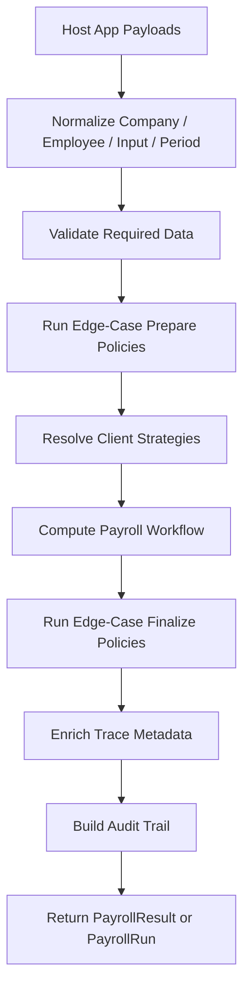

# Architecture Overview

This document explains how the package is structured internally and where to extend it safely.

## Package Goals

The package is designed to:

- provide a reusable payroll computation core
- separate host application data shapes from payroll math
- keep computation auditable and explainable
- allow tenant-, client-, or country-specific overrides without forking the package

## Package Boundaries

The package is responsible for:

- normalizing company, employee, and payroll input payloads
- validating required payroll data
- computing payroll results
- generating payslip, register, and allocation payloads
- enforcing payroll run lifecycle checks
- exposing extension points for strategies and edge-case policies

The package is not responsible for:

- database schema
- attendance ingestion
- HR master data management
- approval UI
- PDF/Excel rendering
- bank file transport

## Major Modules

| Module | Path | Responsibility |
| --- | --- | --- |
| Core engine | `src/PayrollEngine.php` | Public orchestration entry point |
| Service provider and facade | `src/PayrollEngineServiceProvider.php`, `src/PayrollEngineFacade.php` | Laravel container integration |
| Normalizers | `src/Normalizers` | Convert arrays, objects, and models into normalized domain data |
| Validators | `src/Validators` | Reject invalid company, employee, or payroll input |
| Data objects | `src/Data` | Immutable-ish domain payloads such as `PayrollInput`, `PayrollResult`, and `PayrollRun` |
| Calculators | `src/Calculators` | Default payroll math for rates, overtime, taxes, contributions, and workflow |
| Strategies | `src/Strategies` | Resolve client-specific overrides for replaceable calculators |
| Policies | `src/Policies` | Runtime edge-case handling and client preset registry |
| Reports | `src/Reports` | Payslip, payroll register, and allocation summary builders |
| Support | `src/Support` | Shared helpers, trace metadata, audit trail builder, and retro helpers |

## Computation Flow

## Main Flow Of Computation

### 1. Input normalization

The engine accepts arrays, objects, Eloquent models, and package data objects.

Normalizers convert them into:

- `CompanyProfile`
- `EmployeeProfile`
- `PayrollInput`
- `PayrollPeriod`

This keeps downstream calculators working with stable structures instead of raw host-app payloads.

### 2. Validation

Before math runs, validators confirm:

- required company fields exist
- employee identity and payroll data are usable
- payroll inputs are structurally valid

This helps fail fast before partial results are created.

### 3. Edge-case prepare phase

The edge-case policy pipeline runs first so it can:

- reject conflicting rules
- require attendance
- merge overlapping deductions
- reshape input before the workflow begins

### 4. Strategy resolution

The strategy resolver chooses which calculator or workflow class to use for the active `client_code`.

Available replaceable strategy areas:

- `workflow`
- `rate`
- `overtime`
- `variable_earnings`
- `withholding`
- `pagibig`

### 5. Workflow calculation

The selected payroll workflow builds the result by coordinating:

- rate calculation
- regular earnings
- variable earnings
- contributions
- taxes
- deductions
- totals

### 6. Edge-case finalize phase

After a `PayrollResult` exists, the policy pipeline can:

- defer deductions
- append warnings
- cap take-home pay for partial payout
- make post-computation adjustments

### 7. Trace and audit enrichment

The engine enriches the result with:

- strategy names
- policy names
- line-level trace metadata
- audit trail details

This is one of the package's major differentiators for payroll review and support.

## Where Business Rules Live

Business rules live in several layers:

- published config for defaults and presets
- calculator strategies for reusable math rules
- workflow implementations for full-sequence custom logic
- edge-case policies for contextual pre/post handling
- normalizers for host-payload interpretation

## Extensibility Model

The package is extensible by design.

Use:

- `presets` for client-specific default values
- `strategies` for client-specific calculators or workflows
- runtime `edge_case_policy` metadata for per-company, per-employee, or per-run rules
- `edge_case_policies` for replacing the prepare/finalize policy pipeline

## Output Structure

The core outputs are:

- `PayrollResult` for one employee
- `PayrollRun` for a payroll period batch
- payslip payload arrays
- payroll register rows
- allocation summaries

These outputs are designed to be consumed by host applications, not to replace host persistence models.

## Recommended Extension Boundaries

For most customizations:

- keep host DB models outside the package
- keep payload mapping in the host application
- replace only the narrowest strategy necessary
- use a full custom workflow only when a narrow strategy override is insufficient

## Related Guides

- [Extending the Package](extending.md)
- [Policies Guide](policies.md)
- [API Reference](api-reference.md)

