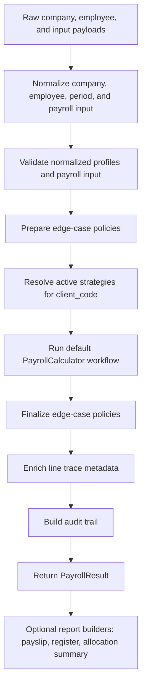

# Default Pipeline Guide

This guide explains the package's default internal payroll sequence.

It is specifically about the path used when the active workflow resolves to `QuillBytes\PayrollEngine\Calculators\PayrollCalculator`.

If a client replaces the full `workflow` strategy, the external `PayrollEngine` steps still apply, but the internal computation stages described here may differ.

## Why This Guide Exists

For maintainers, most difficult package issues are not about one formula in isolation. They are usually about:

- a default was merged from an unexpected place
- a run type changed which stages are active
- a policy modified the result after the workflow finished
- a report looked wrong because the upstream result was already wrong

This guide maps the default flow to the components, config keys, and debug checkpoints that matter.

## End-To-End Flow



## Stage Map

| Stage | Main class | Main output | Common keys that influence it |
| --- | --- | --- | --- |
| Company normalization | `CompanyProfileNormalizer` | `CompanyProfile` | `defaults`, `presets`, company payload overrides |
| Employee normalization | `EmployeeProfileNormalizer` | `EmployeeProfile` | employee compensation, statutory, allocation, payroll fields |
| Period normalization | `PayrollPeriodNormalizer` | `PayrollPeriod` | `release_lead_days`, `run_type`, explicit period dates |
| Payroll input normalization | `PayrollInputNormalizer` | `PayrollInput` | overtime, variable earnings, deductions, bonus, projected annual income |
| Validation | validators in `src/Validators` | exceptions or clean input | required company, employee, and input fields |
| Prepare policies | `PayrollEdgeCasePolicyPipeline::prepare()` | possibly adjusted `PayrollInput` | runtime `edge_case_policy`, custom pipeline config |
| Strategy resolution | `PayrollStrategyResolver` | workflow and calculator instances | `strategies.default`, `strategies.clients.{client_code}` |
| Default workflow | `PayrollCalculator` | `PayrollResult` | run type, rates, contributions, taxes, deductions |
| Finalize policies | `PayrollEdgeCasePolicyPipeline::finalize()` | possibly adjusted `PayrollResult` | runtime `edge_case_policy`, custom pipeline config |
| Trace enrichment | `PayrollResultTraceEnricher` | richer line metadata | existing line metadata or fallback trace defaults |
| Audit build | `PayrollAuditTrailBuilder` | `audit` array | applied strategies, policies, key rates, totals, formulas |
| Report building | report builders in `src/Reports` | arrays | existing `PayrollResult` or `PayrollRun` only |

## 1. Company Normalization

### Main Class

- `src/Normalizers/CompanyProfileNormalizer.php`

### What Happens

The company payload is converted into a normalized `CompanyProfile`.

This is where most package defaults are resolved.

Merge precedence for baseline company policy values is:

1. client policy registry defaults
2. published config `defaults`
3. published config `presets.{client_code}`
4. explicit company payload values

This means a company payload always wins over config.

### Default Keys Resolved Here

- `frequency`
- `hours_per_day`
- `work_days_per_year`
- `release_lead_days`
- `eemr_factor`
- `manual_overtime_pay`
- `fixed_per_day_rate`
- `separate_allowance_payout`
- `external_leave_management`
- `split_monthly_statutory_across_periods`
- `pagibig_mode`
- `pagibig_schedule`
- `tax_strategy`
- `annual_bonus_tax_shield`
- `work_day_ot_premium`
- `rest_day_ot_premium`
- `holiday_ot_premium`
- `rest_day_holiday_ot_premium`
- `night_shift_differential_premium`

### Sample

```php
$company = [
    'name' => 'Tenant A',
    'client_code' => 'tenant-a',
    'fixed_per_day_rate' => true,
    'tax_strategy' => 'projected_annualized',
    'payroll_schedules' => [
        [
            'pay_date' => '15',
            'period_start' => '1',
            'period_end' => '15',
        ],
    ],
];
```

In this example:

- published `defaults` still fill any missing keys
- `presets.tenant-a` overrides package defaults for that client
- the explicit company values above still win over both

### Debug Checkpoint

If a package-wide default or tenant preset appears to be ignored, inspect the normalized `CompanyProfile` first. The bug is often in normalization or payload mapping, not the downstream calculator.

## 2. Employee Normalization

### Main Class

- `src/Normalizers/EmployeeProfileNormalizer.php`

### What Happens

The employee payload is converted into `EmploymentProfile`, `CompensationProfile`, `StatutoryProfile`, `PayrollDetails`, and `AllocationProfile`, then wrapped in `EmployeeProfile`.

This is where nested aliases such as `compensation.monthly_basic_salary` or `statutory.manual_pagibig_contribution` are mapped into the internal DTOs.

### Fields That Commonly Affect Later Stages

- `monthly_basic_salary`
- `daily_rate`
- `hourly_rate`
- `projected_annual_taxable_income`
- `representation`
- `allowances`
- `minimum_wage_earner`
- `manual_sss_contribution`
- `manual_philhealth_contribution`
- `manual_pagibig_contribution`
- `upgraded_pagibig_contribution`
- employee `pagibig_schedule`
- `tax_shield_amount_for_bonuses`
- allocation fields like `project_code`, `cost_center`, `branch`, `department`, `vessel`

### Debug Checkpoint

If a report has the wrong bank details, department, or allowance totals, trace back to `EmployeeProfileNormalizer`. The report builders only serialize the already-normalized result.

## 3. Period And Payroll Input Normalization

### Main Classes

- `src/Normalizers/PayrollPeriodNormalizer.php`
- `src/Normalizers/PayrollInputNormalizer.php`

### What Happens

The period is normalized first. If `release_date` is missing but `end_date` is present, the engine derives release date as:

```text
end_date - company.release_lead_days
```

Then payroll input is normalized into:

- overtime entries
- variable earning entries
- adjustments
- manual deductions
- loan deductions
- bonus
- attendance deductions
- Pag-IBIG loan amortization flags
- projected annual taxable income

### Input Keys Resolved Here

- `period.key`
- `period.start_date`
- `period.end_date`
- `period.release_date`
- `period.run_type`
- `overtime`
- `manual_overtime_pay`
- `variable_earnings`
- `sales_commissions`
- `production_incentives`
- `quota_bonuses`
- `adjustments`
- `manual_deductions`
- `loan_deductions`
- `leave_deduction`
- `absence_deduction`
- `late_deduction`
- `undertime_deduction`
- `bonus`
- `used_annual_bonus_shield`
- `pagibig_loan_amortization`
- `pagibig_due_this_run`
- `projected_annual_taxable_income`
- `edge_case_policy`

### Debug Checkpoint

If a release date is unexpectedly early or late, inspect the normalized `PayrollPeriod` before looking at the batch lifecycle rules.

## 4. Validation

### Main Classes

- `src/Validators/CompanyProfileValidator.php`
- `src/Validators/EmployeeProfileValidator.php`
- `src/Validators/PayrollInputValidator.php`

### What Happens

The engine fails fast on structurally invalid data before any payroll math runs.

Examples of enforced rules:

- company name, schedules, preparers, and approvers must be present
- EEMR factor, hours per day, and work days per year must be positive
- employee number, full name, email, TIN, bank details, and monthly salary must be valid
- payroll period start date cannot be later than end date
- overtime hours and monetary inputs cannot be negative

### Debug Checkpoint

If a host app recently changed data mapping and the package starts throwing validation errors, compare the raw payload and the normalized DTO rather than patching downstream calculators.

## 5. Prepare-Phase Policy Pipeline

### Main Classes

- `src/Policies/PayrollEdgeCasePolicyPipeline.php`
- default policies from `src/Policies`

### What Happens

Before the workflow runs, the engine gives each configured policy a chance to inspect or reshape the normalized `PayrollInput`.

Default policy order when `edge_case_policies` is not configured:

1. `RuleConflictPolicy`
2. `AttendanceDataPolicy`
3. `DeductionOverlapPolicy`
4. `NetPayResolutionPolicy`

### Keys That Commonly Affect This Stage

Runtime metadata under `edge_case_policy`:

- `attendance_required`
- `no_attendance_data`
- `overlapping_deductions`
- `negative_net_pay`
- `minimum_take_home_pay`
- `partial_payout_limit`

### Debug Checkpoint

If normalized input looks correct but computation still behaves differently from expectations, inspect whether a prepare-phase policy changed the input before the workflow started.

## 6. Strategy Resolution

### Main Class

- `src/Strategies/PayrollStrategyResolver.php`

### What Happens

The resolver selects the active workflow and narrow calculator strategies for the current `client_code`.

Resolution precedence is:

1. `strategies.clients.{client_code}.{key}`
2. `strategies.default.{key}`
3. package fallback classes

If the resolved workflow is still the built-in `PayrollCalculator`, the resolver composes it with the active rate, overtime, variable earning, withholding, and Pag-IBIG strategies for that client.

SSS and PhilHealth remain fixed in the default workflow unless the whole workflow is replaced.

### Strategy Keys

- `workflow`
- `rate`
- `overtime`
- `variable_earnings`
- `withholding`
- `pagibig`

### Debug Checkpoint

If one tenant suddenly starts using the wrong formula, inspect the strategy class names in the final audit payload before changing business logic.

## 7. Default Workflow Entry

### Main Class

- `src/Calculators/PayrollCalculator.php`

### What Happens

The default workflow uses run type to decide which stages are active.

Important run-type behaviors from `PayrollRunType`:

- regular runs use scheduled basic pay, regular allowances, mandatory contributions, and regular withholding
- off-cycle runs do not automatically include scheduled basic pay, regular allowances, or mandatory contributions
- final-settlement runs include scheduled basic pay and regular withholding but skip regular allowances and mandatory contributions

### Debug Checkpoint

If a final-pay or bonus run is missing expected lines, confirm the normalized `run_type` first. Many "missing line" issues are intentional run-type gating.

## 8. Rate Calculation

### Main Components

- resolved `RateCalculator` strategy
- `RateSnapshot`

### What Happens

The workflow calculates:

- `monthlyBasicSalary`
- `scheduledBasicPay`
- `dailyRate`
- `hourlyRate`
- `fixedPerDayApplied`

### Keys That Commonly Affect This Stage

- `frequency`
- `eemr_factor`
- `hours_per_day`
- `fixed_per_day_rate`
- employee `daily_rate`
- employee `hourly_rate`
- `run_type`

### Sample Interpretation

Examples:

- a regular semi-monthly employee usually gets `monthly_basic_salary * 12 / periods_per_year`
- a final-settlement run prorates scheduled basic pay using payable days over covered days
- a fixed daily-rate employee uses the explicit employee daily rate when company `fixed_per_day_rate` is enabled

### Debug Checkpoint

If overtime, tardiness, or undertime amounts look wrong, verify rates first. Many downstream amounts are correct relative to a bad upstream hourly or daily rate.

## 9. Earnings Assembly

### What Happens

The workflow then builds earnings and separate payouts in this order:

1. scheduled basic pay
2. regular allowances when run type permits them
3. manual adjustments
4. overtime earnings
5. variable earnings
6. bonus

Allowances become `separate_payout` lines instead of normal earnings when `separate_allowance_payout` is enabled.

### Keys That Commonly Affect This Stage

- `separate_allowance_payout`
- `manual_overtime_pay`
- overtime premium keys
- `run_type`
- employee allowance fields
- input `adjustments`
- input `overtime`
- input variable earning families
- input `bonus`

### Debug Checkpoint

If gross pay is unexpectedly low, check whether a line was routed into `separatePayouts` rather than `earnings`.

## 10. Mandatory Contributions

### What Happens

For regular runs, the workflow computes:

- SSS
- PhilHealth
- Pag-IBIG

It then separates employee and employer shares.

The statutory period divisor is:

- `1` when monthly statutory deductions are not split
- `1` for monthly payroll
- `2` for semi-monthly payroll when splitting is enabled
- `4` for weekly payroll when splitting is enabled

### Keys That Commonly Affect This Stage

- `split_monthly_statutory_across_periods`
- `pagibig_mode`
- `pagibig_schedule`
- input `pagibig_due_this_run`
- input `pagibig_loan_amortization`
- employee manual statutory contribution overrides
- employee upgraded Pag-IBIG contribution

### Important Design Note

Pag-IBIG is strategy-based and replaceable. SSS and PhilHealth are fixed inside the default workflow.

### Debug Checkpoint

If only Pag-IBIG behaves differently for a tenant, the fix is usually a Pag-IBIG strategy or policy decision. If SSS or PhilHealth behavior must change, that usually means replacing the full workflow.

## 11. Deductions, Taxable Income, And Tax

### What Happens

The workflow then assembles deduction lines from:

- loan deductions
- manual deductions
- Pag-IBIG separate deductions when applicable
- attendance-related deductions
- withholding tax
- bonus tax withheld

Taxable income is:

```text
sum(taxable earnings) - sum(employee contributions)
```

and is clamped at zero.

Bonus tax is calculated against:

1. input `projected_annual_taxable_income`
2. employee projected annual taxable income
3. current computed taxable income annualized by periods per year

### Keys That Commonly Affect This Stage

- `tax_strategy`
- `annual_bonus_tax_shield`
- `split_monthly_statutory_across_periods`
- employee `minimum_wage_earner`
- employee `tax_shield_amount_for_bonuses`
- input `used_annual_bonus_shield`
- input `projected_annual_taxable_income`
- attendance deduction inputs
- manual and loan deduction inputs

### Debug Checkpoint

If withholding looks wrong, inspect:

1. normalized run type
2. active `tax_strategy`
3. projected annual taxable income source
4. employee contributions, because they change taxable income before tax

## 12. Final Totals

### What Happens

The default workflow computes:

- `grossPay`
- `taxableIncome`
- `netPay`
- `takeHomePay`
- `bonusTaxWithheld`

Conceptually:

```text
grossPay = sum(earnings)
netPay = grossPay - employee contributions - deductions
takeHomePay = netPay + separate payouts
```

### Debug Checkpoint

If take-home pay is higher than net pay, that is often correct. Separate payouts are intentionally added after net pay.

## 13. Finalize-Phase Policy Pipeline

### What Happens

After the workflow returns a `PayrollResult`, the policy pipeline runs its finalize phase.

This is where policies can:

- add warnings
- merge or reshape deductions
- defer deductions
- enforce minimum take-home behavior
- reject invalid result combinations

### Debug Checkpoint

If the intermediate totals looked right in the workflow but the final result does not, inspect finalize-phase policies before touching the calculators.

## 14. Trace Enrichment

### Main Class

- `src/Support/PayrollResultTraceEnricher.php`

### What Happens

The engine normalizes each line's metadata so every line has at least:

- `source`
- `applied_rule`
- `formula`
- `basis`

If a custom strategy did not supply trace metadata, the enricher adds fallback values.

### Debug Checkpoint

If audit tooling needs line-level explainability, this is the place to preserve or improve metadata instead of rebuilding logic in the presentation layer.

## 15. Audit Trail Build

### Main Class

- `src/Support/PayrollAuditTrailBuilder.php`

### What Happens

The engine attaches an `audit` array to the final `PayrollResult`.

Important audit sections:

- `input_normalization`
- `applied_rules`
- `rates_used`
- `basis_amounts`
- `formulas`
- `warnings_exceptions`

This is the package's most important debugging artifact.

### Debug Checkpoint

When diagnosing a breaking change between package versions, diff the `audit` payload first. It usually tells you whether the change came from defaults, strategy selection, rates, run-type behavior, or policy output.

## 16. Report Builders

### What Happens

Once a `PayrollResult` or `PayrollRun` exists, report builders convert it into delivery shapes:

- `payslip()` serializes one result
- `payrollRegister()` flattens many results
- `allocationSummary()` groups many results by dimension
- `generatePayrollFiles()` adds lifecycle gating to register generation
- `generatePayslips()` adds lifecycle and release-date gating to payslip generation

These builders do not recompute payroll.

### Debug Checkpoint

If a report looks wrong and the underlying `PayrollResult` is already wrong, fix the pipeline. If the `PayrollResult` is correct, then the issue is in the relevant report builder.

## Breakpoint Guide

When stepping through code, these are high-value entry points:

1. `PayrollEngine::compute()`
2. `CompanyProfileNormalizer::normalize()`
3. `PayrollInputNormalizer::normalize()`
4. `PayrollEdgeCasePolicyPipeline::prepare()`
5. `PayrollStrategyResolver::workflowFor()`
6. `PayrollCalculator::calculate()`
7. `PayrollEdgeCasePolicyPipeline::finalize()`
8. `PayrollResultTraceEnricher::enrich()`
9. `PayrollAuditTrailBuilder::build()`
10. the specific report builder or `PayrollRun` lifecycle method in question

## Symptom-To-Stage Quick Map

| Symptom | Usually inspect first |
| --- | --- |
| Wrong default or preset value applied | `CompanyProfileNormalizer` |
| Wrong release date | `PayrollPeriodNormalizer` |
| Employee missing from batch run | `PayrollEngine::run()` active-period filter |
| Wrong daily or hourly rate | resolved `RateCalculator` and `RateSnapshot` |
| Missing allowance or basic pay on a special run | `PayrollRunType` gating inside `PayrollCalculator` |
| Wrong Pag-IBIG behavior | Pag-IBIG strategy plus company and employee contribution schedule inputs |
| Wrong withholding or bonus tax | `WithholdingTaxCalculator`, taxable income basis, and bonus shield inputs |
| Deductions missing or deferred | finalize-phase policies, especially net-pay resolution |
| Payslip or file generation blocked | `PayrollRun` lifecycle guard methods |

## Related Guides

- [Workflow Reference](workflow-reference.md)
- [Architecture Overview](architecture.md)
- [Policies Guide](policies.md)
- [Configuration Reference](configuration-reference.md)
- [Troubleshooting Guide](troubleshooting.md)
